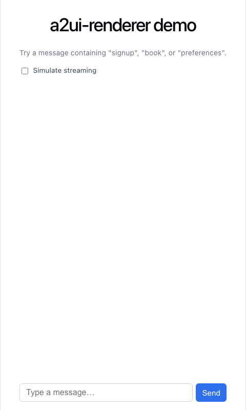
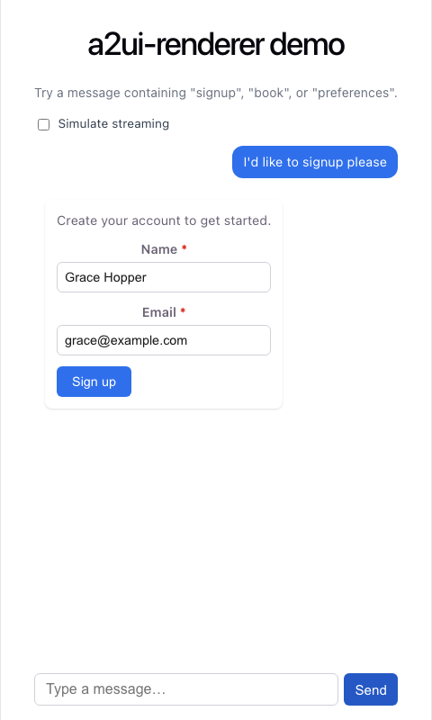
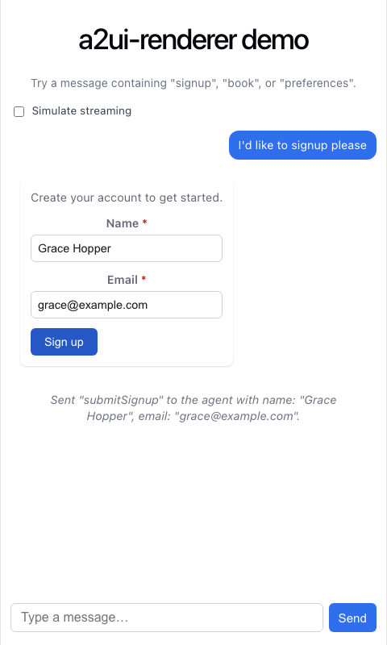
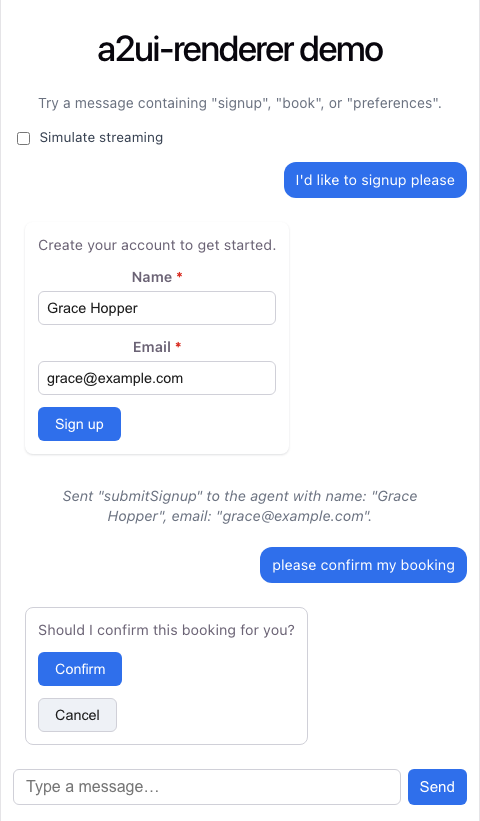
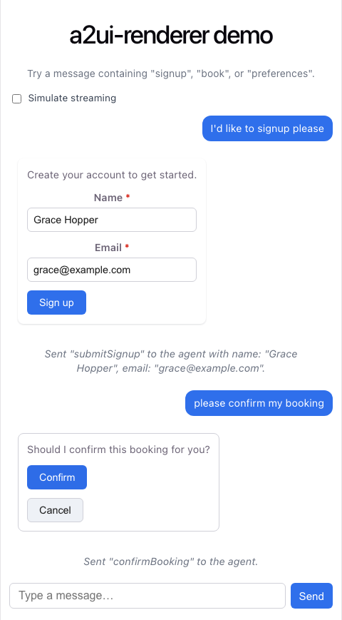
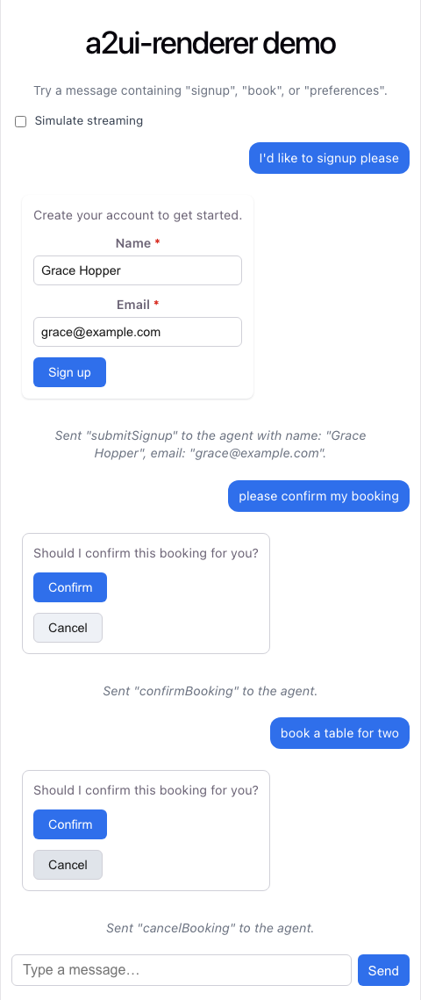
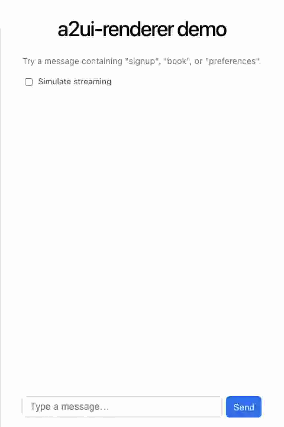

# a2ui-renderer

A React + TypeScript renderer for **A2UI**: a JSON schema an AI agent can send
instead of raw HTML/text, describing a small tree of UI components (cards,
forms, buttons, inputs...) for the client to render and react to. This repo
implements a simplified version of that idea end-to-end — the schema types,
a recursive renderer, a set of presentational components, and a demo chat app
that exercises the whole pipeline against a mock agent.

## Setup

```bash
git clone <this-repo-url>
cd a2ui-renderer
npm install
npm run dev        # start the Vite dev server
npm test           # run the test suite once
npm run test:watch # run tests in watch mode
```

Other useful scripts: `npm run lint`, `npm run format`, `npm run build`.

## Running the demo

```bash
npm install
npm run dev
```

Open **http://localhost:5173** (Vite's default port; it'll print the actual
URL if that port is taken). You'll see a minimal chat interface: a message
input at the bottom, a "Simulate streaming" checkbox, and an empty thread.

Things to try:

- Type a message containing **"signup"** or **"register"** and hit Send — a
  mock agent responds with a card containing a form (name + email fields) and
  a submit button. Try submitting empty to see required-field validation, then
  fill it in and submit to see the collected values echoed back as a "system"
  message (standing in for what a real agent would receive).
- Type a message containing **"confirm"** or **"book"** — the agent responds
  with a card containing text and two buttons (Confirm / Cancel). Click
  either to see the resulting event reported.
- Type a message containing **"preferences"** or **"settings"** — the agent
  responds with a form that mixes all three field types (`select`,
  `text-field`, `checkbox`) to show they interoperate.
- Toggle **"Simulate streaming"** before sending a message: instead of the
  whole response appearing at once, the component tree reveals one node
  roughly every 300ms, simulating a streaming agent response.

Any other message gets a generic fallback reply.






Submitting the form fires the `form-submit` callback, which the demo echoes
back as a "system" message with the collected values:



The booking scenario's two buttons work the same way, firing a plain
`button-click` callback each:







## Architecture

Three layers, each with one job:

1. **Types** (`src/types/a2ui.ts`) define the schema: a discriminated union
   `A2UIComponent` (keyed on `type`) covering `container`, `card`, `text`,
   `button`, `text-field`, `select`, `checkbox`, and `form`, plus
   `A2UIPayload` (a root component + optional `id`/`version`) and `A2UIEvent`
   (`button-click` / `form-submit`, emitted back to the host app).
   `src/types/fixtures.ts` has example payloads used in tests and the demo,
   including one that's intentionally malformed.
2. **Validation** (`src/lib/validateA2UI.ts`) takes an `unknown` value (e.g.
   parsed JSON from a real agent) and returns `{ valid: true, payload }` or
   `{ valid: false, errors }` — unknown component types and missing/mistyped
   required fields are collected as errors instead of thrown.
3. **Renderer** (`src/renderer/A2UIRenderer.tsx`) takes a validation `result`
   and an `onEvent` callback. It recursively dispatches each node to a
   presentational component in `src/components/`, staying "thin": besides
   dispatch, its only jobs are (a) resolving a `form`'s `fieldIds` to the
   actual sibling field components so `Form` can render and validate them
   directly, and (b) owning controlled state for fields that aren't part of
   any form. It's wrapped in an `ErrorBoundary` so a bug in one rendered
   message can't take down the rest of a chat thread, and it renders a clear
   fallback UI instead of crashing when validation fails.

`useStreamedPayload` (a hook, not part of the renderer's public surface) sits
in front of all this: given a full payload, it returns an ordinary
`A2UIPayload` that grows by one node every `intervalMs` — the renderer needs
no special handling for the partial case, since it's just a smaller valid
tree.

The demo (`src/demo/`) is the only piece that knows about "chat": it holds
message history, calls a mock agent for responses, and turns `A2UIEvent`s
into new thread messages.

```
src/
├── types/         A2UIComponent / A2UIPayload / A2UIEvent schema + fixtures
├── lib/           validateA2UI (schema validation for untrusted payloads)
├── renderer/      A2UIRenderer, useStreamedPayload, ErrorBoundary
├── components/    Container, Card, Text, Button, TextField, Select,
│                  Checkbox, Form — one presentational component per schema type
└── demo/          DemoApp (chat UI) + mockAgent (canned keyword-matched replies)
```

## Adding a new component type

Say you want to add an `"image"` component (a URL + alt text). Concretely:

1. **Schema** (`src/types/a2ui.ts`): add an interface and put it in the
   `A2UIComponent` union.
   ```ts
   export interface A2UIImage {
     type: 'image'
     src: string
     alt: string
   }
   ```
   Add `A2UIImage` to `A2UIComponent`'s union.
2. **Validation** (`src/lib/validateA2UI.ts`): add `'image'` to
   `COMPONENT_TYPES`, and a `case 'image':` branch checking `src`/`alt` are
   strings.
3. **Presentational component** (`src/components/Image.tsx`): a small
   component rendering ``
   (the `a2ui-enter` class gets you the same fade-in-on-mount treatment as
   every other component, for free).
4. **Wire it into the renderer** (`src/renderer/A2UIRenderer.tsx`): add a
   `case 'image':` to `renderComponent`'s switch returning
   `<Image key={key} src={component.src} alt={component.alt} />`. If the new
   type can appear inside a form (like `text-field`/`select`/`checkbox`),
   also add it to `A2UIFormField` and to `collectFormMeta`'s switch.
5. **Styling**: add `.a2ui-image { ... }` to `src/renderer/A2UIRenderer.css`.
6. **Tests**: add `src/components/__tests__/Image.test.tsx` following the
   pattern of the existing component tests (render, props reflected,
   interaction if any).
7. Optionally add a fixture in `src/types/fixtures.ts` exercising it, and a
   keyword branch in `src/demo/mockAgent.ts` so it's reachable from the demo.

TypeScript's exhaustiveness checking is doing real work here: leave a `case`
out of `A2UIRenderer`'s switch (or `validateA2UI`'s) and, because both switch
over the same discriminated union, the compiler flags it.

## Streaming simulation



`useStreamedPayload` walks the full payload tree and reveals one descendant
node every `intervalMs` (default 300ms), in pre-order — a container or card
starts empty and its children "arrive" one at a time, including nested ones.
It always returns a real `A2UIPayload`, so `A2UIRenderer` never has a
separate code path for "partial" vs "full" trees. In the demo, toggling
"Simulate streaming" before sending a message threads `enabled: streaming`
into the hook for that message only — messages already in the thread keep
whichever mode they were created under.

## Generating the media in this README

The screenshots and GIF above aren't checked in as manually-captured files —
they're generated by `scripts/capture-media.ts`, which starts the Vite dev
server in-process, drives the demo in headless Chromium via
[Playwright](https://playwright.dev), and writes everything to
`docs/media/`. Regenerate them with:

```bash
npx playwright install chromium   # one-time, downloads the browser binary
npm run capture-media
```

Notes on the GIF specifically: no system-wide `ffmpeg` was available in this
environment. Playwright does download its own ffmpeg build for internal
video post-processing, and the script locates and reuses that binary — but
it's compiled with `--disable-everything` and only has `pad`/`crop`/`scale`
filters and a PNG encoder (no `fps`, `palettegen`/`paletteuse`, or GIF
muxer), so it can extract frames but can't produce a GIF directly. The script
uses it to extract a scaled-down PNG frame sequence from the recorded video,
then assembles those frames into the final GIF with the pure-JS
`gif-encoder-2` + `pngjs` packages (no native/system dependency, so nothing
to fail to compile in a sandboxed environment). If that bundled ffmpeg can't
be found at all, the script falls back to writing a plain screenshot
sequence (`docs/media/streaming-*.png`) showing the reveal progression
instead of silently skipping the GIF — see `captureStreamingScreenshotSequence`
in the script.

## Known limitations / out of scope

- **This is not the Google A2UI spec.** "A2UI" here refers to a small,
  custom JSON schema _inspired by_ the idea of an agent describing UI
  instead of returning raw text — it was designed from scratch for this
  project, not derived from or validated against Google's actual A2UI
  protocol/examples. No real A2UI example payloads were integrated or
  tested against.
- Only six-plus-two component types exist (`container`, `card`, `text`,
  `button`, `text-field`, `select`, `checkbox`, `form`). No lists/repeaters,
  images, tabs, dates, or nested forms.
- A `form` references its fields by `fieldId` rather than nesting them as
  children; at most one form per container/card is supported (a second
  sibling form in the same children array isn't handled).
- The mock "agent" in the demo is keyword matching over a handful of
  strings, not a real LLM or backend — there's no real network round trip,
  auth, or persistence.
- Validation (`validateA2UI`) checks structural shape (types, required
  fields, known enums) but doesn't validate cross-field invariants (e.g. a
  `form`'s `fieldIds` actually resolving to existing fields elsewhere in the
  tree) or enforce a max tree depth/size.
- No accessibility audit beyond basic semantics (labels, `role="alert"` on
  errors, `aria-invalid`); no i18n.
- Styling is hand-rolled, plain CSS (see `src/renderer/A2UIRenderer.css` and
  `src/demo/App.css`) — no design system or CSS-in-JS, by design (see the
  "polish" task's constraint against adding a UI library dependency).
